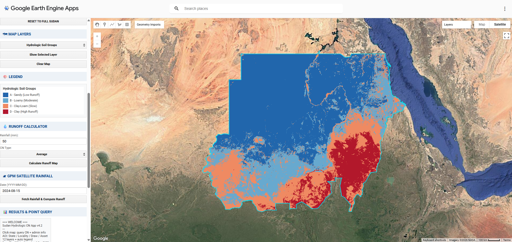

<a id="top"></a>

<!-- ═══════════════════════════════════════════════════════════ -->
<!-- WAVE HEADER                                                 -->
<!-- ═══════════════════════════════════════════════════════════ -->

<div align="center">

</div>

<!-- ═══════════════════════════════════════════════════════════ -->
<!-- ANIMATED TYPING + BADGES                                    -->
<!-- ═══════════════════════════════════════════════════════════ -->

<div align="center">

<a href="https://ee-osmangeomatics1993.projects.earthengine.app/view/sudan-hydrologic-curve-number-application">
  
</a>

<br>

[](https://ee-osmangeomatics1993.projects.earthengine.app/view/sudan-hydrologic-curve-number-application)
[](LICENSE)
[](https://earthengine.google.com)
[](https://doi.org/10.1038/s41597-019-0155-x)

<br>


<br>

**A free, open-source web application for computing improved hydrologic curve numbers, rainfall-runoff estimation, and flood risk assessment across Sudan.**

**No software installation. No coding required. Just open and analyze.**

[🚀 Launch App](https://ee-osmangeomatics1993.projects.earthengine.app/view/sudan-hydrologic-curve-number-application) · [📖 Documentation](#-documentation) · [🐛 Report Bug](../../issues) · [💡 Request Feature](../../issues)

</div>

<br>

<!-- ═══════════════════════════════════════════════════════════ -->
<!-- EVERYTHING YOU NEED BANNER                                  -->
<!-- ═══════════════════════════════════════════════════════════ -->

<div align="center">
<table>
<tr>
<td align="center">

### 📢 Everything About This Project Is Here

🧮 **19 Scientific Equations** · 📐 **Full Methodology & Derivations** · 🔬 **Interactive LaTeX Equations**
📡 **7 Satellite Datasets Documented** · 💧 **SCS-CN Runoff Theory** · 🌊 **Flood Risk Index Formula**
📸 **App Screenshots** · 🎬 **Video Demo** · 📖 **Deployment Guide** · 🗺 **Roadmap & FAQ**

<br>

> *From Hydrologic Soil Group classification to the SCS-CN runoff equation,*
> *from Sharpley-Williams slope correction to GPM satellite rainfall processing —*
> ***every equation, every method, every dataset is fully documented in this repository.***

<br>

[](docs/METHODOLOGY.md)
[](https://osman-geomatics93.github.io/Sudan-GCN-App/docs/Methodology_Equations.html)
[](https://ee-osmangeomatics1993.projects.earthengine.app/view/sudan-hydrologic-curve-number-application)

</td>
</tr>
</table>
</div>

<br>

<!-- ═══════════════════════════════════════════════════════════ -->
<!-- TECH STACK                                                  -->
<!-- ═══════════════════════════════════════════════════════════ -->

<div align="center">

<b>Built With</b>

<br><br>


</div>

<br>

<!-- ═══════════════════════════════════════════════════════════ -->
<!-- DEMO VIDEO                                                  -->
<!-- ═══════════════════════════════════════════════════════════ -->

<div align="center">

### 🎬 Application Demo

<a href="https://github.com/Osman-Geomatics93/Sudan-GCN-App/raw/main/Video/CN.mp4">
  
</a>

<br><br>

https://github.com/Osman-Geomatics93/Sudan-GCN-App/raw/main/Video/CN.mp4

<sub>📽 Interactive walkthrough — CN mapping, point queries, runoff calculation & data export</sub>

</div>

<br>

<!-- ═══════════════════════════════════════════════════════════ -->
<!-- TABLE OF CONTENTS                                           -->
<!-- ═══════════════════════════════════════════════════════════ -->

<div align="center">
<table>
<tr>
<td align="center"><a href="#-why-this-app"><b>💡 Why This App</b></a></td>
<td align="center"><a href="#-overview"><b>🔬 Overview</b></a></td>
<td align="center"><a href="#-key-features"><b>✨ Features</b></a></td>
<td align="center"><a href="#-live-demo"><b>🌍 Live Demo</b></a></td>
<td align="center"><a href="#-data-sources"><b>📡 Data</b></a></td>
</tr>
<tr>
<td align="center"><a href="#-methodology"><b>🧮 Methodology</b></a></td>
<td align="center"><a href="#-getting-started"><b>🚀 Get Started</b></a></td>
<td align="center"><a href="#-usage-guide"><b>📖 Usage</b></a></td>
<td align="center"><a href="#-screenshots"><b>📸 Screenshots</b></a></td>
<td align="center"><a href="#-documentation"><b>📚 Docs</b></a></td>
</tr>
<tr>
<td align="center"><a href="#-roadmap"><b>🗺 Roadmap</b></a></td>
<td align="center"><a href="#-faq"><b>❓ FAQ</b></a></td>
<td align="center"><a href="#-citation"><b>📝 Citation</b></a></td>
<td align="center"><a href="#-contributing"><b>🤝 Contributing</b></a></td>
<td align="center"><a href="#-star-history"><b>⭐ Stars</b></a></td>
</tr>
</table>
</div>

<br>

<!-- ═══════════════════════════════════════════════════════════ -->
<!-- WHY THIS APP                                                -->
<!-- ═══════════════════════════════════════════════════════════ -->

<div align="center">

</div>

## 💡 Why This App?

<table>
<tr>
<td width="50%">

### ❌ Before This App
- Hydrologic data for Sudan is **scattered** across agencies
- Requires **expensive software** (ArcGIS, ERDAS)
- Needs **coding skills** to process satellite data
- **Days to weeks** to compute CN for one region
- No **integrated** rainfall-runoff tool for Sudan
- Results **not reproducible** or shareable

</td>
<td width="50%">

### ✅ With This App
- **All 6 datasets** unified in one interface
- **100% free** — runs in any browser
- **Zero coding** — point, click, analyze
- **Instant results** — CN computed in seconds
- **Integrated** GPM rainfall + SCS-CN runoff
- **Reproducible** — same data, same results, shareable URL

</td>
</tr>
</table>

<div align="center">
<sub><b>🎯 Impact:</b> Researchers, students, and agencies can now perform hydrologic analysis for any location in Sudan — instantly, for free.</sub>
</div>

<p align="right"><a href="#top">⬆ Back to Top</a></p>

<br>

<!-- ═══════════════════════════════════════════════════════════ -->
<!-- OVERVIEW                                                    -->
<!-- ═══════════════════════════════════════════════════════════ -->

<div align="center">

</div>

## 🔬 Overview

Sudan faces increasing flood risks due to climate change, yet hydrologic data for the country remains scattered, hard to access, and often requires expensive software to process. This application addresses that gap by combining **6 global satellite datasets** into a single interactive tool.

The app computes improved **SCS Curve Numbers** for any location in Sudan using the **GCN250 methodology** (Jaafar et al., 2019), enhanced with:
- **10-meter land cover** resolution from ESA WorldCover
- **Slope-adjusted CN** using the Sharpley-Williams equation
- **Seasonal NDVI correction** for vegetation dynamics
- **Real-time satellite rainfall** from NASA GPM IMERG

<p align="right"><a href="#top">⬆ Back to Top</a></p>

<br>

<!-- ═══════════════════════════════════════════════════════════ -->
<!-- KEY FEATURES                                                -->
<!-- ═══════════════════════════════════════════════════════════ -->

<div align="center">

</div>

## ✨ Key Features

| Feature | Description |
|---------|-------------|
| 🗺 **12 Map Layers** | CN (5 variants), Land Cover, Soil Groups, Slope, Elevation, NDVI, Flood Risk, Population |
| 📌 **Flexible AOI** | Select by State, Locality, drawn polygon/rectangle/point, or uploaded shapefile |
| 💧 **Runoff Calculator** | SCS-CN method with manual rainfall input and 5 CN types |
| 🛰 **GPM Integration** | Fetch real NASA GPM IMERG satellite rainfall for any date |
| 📊 **Point Query** | Click anywhere for instant CN values + State + Locality info |
| 🎨 **Dynamic Legend** | Auto-updating gradient and categorical legends |
| 📈 **AOI Statistics** | Mean, StdDev, Min, Max for any selected area |
| 💾 **Data Export** | Download GeoTIFF via link or export to Google Drive |

<p align="right"><a href="#top">⬆ Back to Top</a></p>

<br>

<!-- ═══════════════════════════════════════════════════════════ -->
<!-- LIVE DEMO                                                   -->
<!-- ═══════════════════════════════════════════════════════════ -->

<div align="center">

</div>

## 🌍 Live Demo

**Launch the app now** — no login required:

<div align="center">

### 🔗 [https://ee-osmangeomatics1993.projects.earthengine.app/view/sudan-hydrologic-curve-number-application](https://ee-osmangeomatics1993.projects.earthengine.app/view/sudan-hydrologic-curve-number-application)

</div>

> 🎥 **New to the app?** Watch the [video walkthrough above](#-application-demo) to see it in action before you start.

<p align="right"><a href="#top">⬆ Back to Top</a></p>

<br>

<!-- ═══════════════════════════════════════════════════════════ -->
<!-- DATA SOURCES                                                -->
<!-- ═══════════════════════════════════════════════════════════ -->

<div align="center">

</div>

## 📡 Data Sources

| Dataset | Resolution | Source | Usage |
|---------|-----------|--------|-------|
| ESA WorldCover 2021 | 10 m | ESA / Copernicus | Land cover classification |
| OpenLandMap SoilGrids | 250 m | ISRIC | Hydrologic Soil Groups (HSG) |
| USGS SRTM | 30 m | NASA / USGS | Elevation & slope |
| MODIS MOD13A2 | 1 km | NASA | NDVI seasonal adjustment |
| NASA GPM IMERG V07 | 0.1° | NASA | Satellite rainfall |
| WorldPop 2020 | 100 m | WorldPop | Population density |
| FAO GAUL 2015 | Admin | FAO / UN | State & locality boundaries |

<p align="right"><a href="#top">⬆ Back to Top</a></p>

<br>

<!-- ═══════════════════════════════════════════════════════════ -->
<!-- METHODOLOGY                                                 -->
<!-- ═══════════════════════════════════════════════════════════ -->

<div align="center">

</div>

## 🧮 Methodology

<div align="center">

[](docs/METHODOLOGY.md)
[-0077B6?style=for-the-badge)](https://osman-geomatics93.github.io/Sudan-GCN-App/docs/Methodology_Equations.html)

</div>

The application follows the **GCN250 framework** (Jaafar et al., 2019) with slope and vegetation enhancements. The processing pipeline:

```
ESA WorldCover (10m) ──→ USDA Land Use ──┐
                                         ├──→ CN Lookup Table ──→ CN avg (ARC II) ──→ 5 CN Products
SoilGrids (Clay/Sand%) ──→ HSG (A/B/C/D)┘                             │
                                                          ┌────────────┼────────────┐
                                                      CN Dry (I)  CN Wet (III)  CN Slope  CN Seasonal
                                                                                   ↑          ↑
                                                                              SRTM Slope  MODIS NDVI
```

### Five CN Products

| Product | Description | Formula |
|---------|-------------|---------|
| **CN Average (ARC II)** | Standard antecedent conditions | Direct lookup |
| **CN Dry (ARC I)** | Dry soil conditions | CN(I) = 4.2×CN(II) / (10 - 0.058×CN(II)) |
| **CN Wet (ARC III)** | Saturated soil conditions | CN(III) = 23×CN(II) / (10 + 0.13×CN(II)) |
| **CN Slope-Adjusted** | Terrain-corrected CN | Sharpley-Williams equation |
| **CN Seasonal** | Vegetation-adjusted CN | NDVI-based reduction factor |

### Core Equations

| Equation | Formula | Description |
|----------|---------|-------------|
| **Retention** | `S = (25400 / CN) - 254` | Max soil water retention (mm) |
| **Abstraction** | `Ia = 0.2 × S` | Initial abstraction before runoff |
| **Runoff** | `Q = (P - Ia)² / (P - Ia + S)` | Direct surface runoff (P > Ia) |
| **Flood Risk** | `FRI = 0.4×CN + 0.3×Slope_inv + 0.3×Pop` | Composite risk index (0–1) |

> **📐 19 equations fully documented** — See [METHODOLOGY.md](docs/METHODOLOGY.md) for complete derivations, variable tables, and CN lookup values, or view the [Interactive HTML version](https://osman-geomatics93.github.io/Sudan-GCN-App/docs/Methodology_Equations.html) with rendered LaTeX equations.

<p align="right"><a href="#top">⬆ Back to Top</a></p>

<br>

<!-- ═══════════════════════════════════════════════════════════ -->
<!-- PROJECT STRUCTURE                                           -->
<!-- ═══════════════════════════════════════════════════════════ -->

<div align="center">

</div>

## 📁 Project Structure

```
Sudan-GCN-App/
├── README.md                          # This file
├── LICENSE                            # MIT License
├── CHANGELOG.md                       # Version history
├── CONTRIBUTING.md                    # Contribution guidelines
├── .gitignore                         # Git ignore rules
├── .gitattributes                     # Git LFS config
│
├── scripts/
│   ├── index.html                     # 🔒 Password-protected script viewer
│   ├── Sudan_GCN_APP.js.enc          # Encrypted GEE App version
│   └── Sudan_GCN_CodeEditor.js.enc   # Encrypted Code Editor version
│
├── docs/
│   ├── METHODOLOGY.md                 # Full scientific methodology (19 equations)
│   ├── Methodology_Equations.html     # Interactive HTML with LaTeX rendering
│   └── Deployment_Guide.html         # How to publish as GEE App
│
├── assets/
│   ├── overview.png                   # App overview screenshot
│   ├── Point Query.png                # Point query screenshot
│   └── State Selection.png            # State selection screenshot
│
├── Video/
│   └── CN.mp4                         # Application demo video (LFS)
│
└── .github/
    └── ISSUE_TEMPLATE.md             # Bug report / feature request template
```

### Script Versions

> 🔒 **Scripts are password-protected.** Access them via the [Protected Script Viewer](https://osman-geomatics93.github.io/Sudan-GCN-App/scripts/).

| File | Use Case | Export Method |
|------|----------|--------------|
| `Sudan_GCN_APP.js` | Published GEE App | `getDownloadURL()` + `Export.toDrive()` |
| `Sudan_GCN_CodeEditor.js` | Personal research in Code Editor | `Export.toDrive()` + `print()` |

<p align="right"><a href="#top">⬆ Back to Top</a></p>

<br>

<!-- ═══════════════════════════════════════════════════════════ -->
<!-- GETTING STARTED                                             -->
<!-- ═══════════════════════════════════════════════════════════ -->

<div align="center">

</div>

## 🚀 Getting Started

### Option 1: Use the Live App (Recommended)

Just open the link — no setup needed:

🔗 **[Launch App](https://ee-osmangeomatics1993.projects.earthengine.app/view/sudan-hydrologic-curve-number-application)**

### Option 2: Run in GEE Code Editor

1. Open the [Protected Script Viewer](https://osman-geomatics93.github.io/Sudan-GCN-App/scripts/) and enter the password
2. Select **Code Editor Version** and click **Unlock**
3. Copy the decrypted script
4. Paste into [code.earthengine.google.com](https://code.earthengine.google.com)
5. Click **▶ Run**

### Option 3: Deploy Your Own App

See the [Deployment Guide](https://osman-geomatics93.github.io/Sudan-GCN-App/docs/Deployment_Guide.html) for step-by-step instructions.

<p align="right"><a href="#top">⬆ Back to Top</a></p>

<br>

<!-- ═══════════════════════════════════════════════════════════ -->
<!-- USAGE GUIDE                                                 -->
<!-- ═══════════════════════════════════════════════════════════ -->

<div align="center">

</div>

## 📖 Usage Guide

### 1. Select Area of Interest

| Method | How |
|--------|-----|
| **State** | Choose from dropdown → click "Apply State" |
| **Locality** | Select state first → choose locality → "Apply Locality" |
| **Draw** | Click Rectangle/Polygon/Point → draw on map → "Apply Drawn AOI" |
| **Shapefile** | Upload to GEE Assets → paste asset path → "Load Asset as AOI" |

### 2. Explore Map Layers

Select any of 12 layers from the dropdown. The map and legend update automatically.

### 3. Point Query

Click anywhere on the map to get:
- Land cover class, soil group, clay/sand %, elevation, slope, NDVI
- All 5 CN values
- Estimated runoff and flood risk
- State and locality name

### 4. Calculate Runoff

Enter rainfall (mm) → select CN type → click "Calculate Runoff Map"

### 5. Satellite Rainfall

Enter a date (YYYY-MM-DD) → click "Fetch Rainfall & Compute Runoff"

### 6. Download Data

- **In App**: Select product + scale → "Generate Download Link" → click blue link
- **In Code Editor**: "Export to Drive" → Tasks tab → click RUN

<p align="right"><a href="#top">⬆ Back to Top</a></p>

<br>

<!-- ═══════════════════════════════════════════════════════════ -->
<!-- SCREENSHOTS                                                 -->
<!-- ═══════════════════════════════════════════════════════════ -->

<div align="center">

</div>

## 📸 Screenshots

<div align="center">

<details open>
<summary><b>🗺 App Overview — Hydrologic Soil Groups Layer</b></summary>
<br>

<br>
<sub>Full Sudan view with Hydrologic Soil Groups (HSG) layer, legend, runoff calculator & satellite rainfall panel</sub>
<br><br>
</details>

<details open>
<summary><b>📌 Point Query — Interactive Map Click</b></summary>
<br>

<br>
<sub>Click anywhere to retrieve CN values, soil properties, elevation, slope, NDVI and administrative info</sub>
<br><br>
</details>

<details open>
<summary><b>🏛 State Selection — AOI by Administrative Boundary</b></summary>
<br>

<br>
<sub>Select any of Sudan's 18 states from the dropdown to focus analysis on a specific region</sub>
<br><br>
</details>

</div>

<p align="right"><a href="#top">⬆ Back to Top</a></p>

<br>

<!-- ═══════════════════════════════════════════════════════════ -->
<!-- DOCUMENTATION                                               -->
<!-- ═══════════════════════════════════════════════════════════ -->

<div align="center">

</div>

## 📚 Documentation

| Document | Description |
|----------|-------------|
| [Scientific Methodology](docs/METHODOLOGY.md) | Complete mathematical framework — 19 equations, CN lookup tables, all derivations |
| [Interactive Equations (HTML)](https://osman-geomatics93.github.io/Sudan-GCN-App/docs/Methodology_Equations.html) | Beautiful rendered version with KaTeX LaTeX, flowcharts, and variable tables |
| [Deployment Guide](https://osman-geomatics93.github.io/Sudan-GCN-App/docs/Deployment_Guide.html) | Step-by-step guide to publish as GEE App |

<p align="right"><a href="#top">⬆ Back to Top</a></p>

<br>

<!-- ═══════════════════════════════════════════════════════════ -->
<!-- ROADMAP                                                     -->
<!-- ═══════════════════════════════════════════════════════════ -->

<div align="center">

</div>

## 🗺 Roadmap

<table>
<tr>
<td>

**✅ Completed**
- [x] 12 interactive map layers
- [x] 5 CN products (Avg, Dry, Wet, Slope, Seasonal)
- [x] SCS-CN runoff calculator
- [x] NASA GPM satellite rainfall integration
- [x] 4 AOI selection methods
- [x] Point query with full data stack
- [x] GeoTIFF download + Google Drive export
- [x] Published as GEE App
- [x] Full scientific documentation (19 equations)

</td>
<td>

**🔄 Planned**
- [ ] Chart panel for CN distribution & runoff curves
- [ ] Multi-country expansion (East Africa)
- [ ] Time series analysis for seasonal CN changes
- [ ] Multi-language support (Arabic / English)
- [ ] Mobile-optimized responsive layout
- [ ] Watershed delineation integration
- [ ] Historical flood event comparison
- [ ] PDF report generation

</td>
</tr>
</table>

> **Have an idea?** [Open a Feature Request](../../issues) — all suggestions welcome!

<p align="right"><a href="#top">⬆ Back to Top</a></p>

<br>

<!-- ═══════════════════════════════════════════════════════════ -->
<!-- FAQ                                                         -->
<!-- ═══════════════════════════════════════════════════════════ -->

<div align="center">

</div>

## ❓ FAQ

<details>
<summary><b>Do I need a Google Earth Engine account?</b></summary>
<br>
No — the published app works directly in your browser. You only need a GEE account if you want to run the Code Editor version or export data to Google Drive.
<br><br>
</details>

<details>
<summary><b>Can I use this for areas outside Sudan?</b></summary>
<br>
The current version is configured for Sudan's boundaries and administrative divisions. However, the methodology (GCN250) is global — the scripts can be adapted for any country by changing the study area and admin boundaries.
<br><br>
</details>

<details>
<summary><b>What does the Curve Number represent?</b></summary>
<br>
The Curve Number (CN) is an empirical parameter (0–100) that indicates runoff potential. Low CN (30–50) = high infiltration, forested/sandy soils. High CN (80–95) = high runoff, urban/clay soils. It's the core parameter in the SCS-CN rainfall-runoff equation.
<br><br>
</details>

<details>
<summary><b>How accurate is the satellite rainfall (GPM)?</b></summary>
<br>
NASA GPM IMERG V07 provides rainfall estimates at ~11 km resolution. It's suitable for regional hydrologic analysis but may underestimate intense localized storms. For detailed engineering design, use ground-based rainfall data when available.
<br><br>
</details>

<details>
<summary><b>Can I download the CN data?</b></summary>
<br>
Yes! In the app, select a product and scale, then click "Generate Download Link" to get a GeoTIFF. In the Code Editor version, you can also export directly to Google Drive.
<br><br>
</details>

<details>
<summary><b>Why is my download link slow or failing?</b></summary>
<br>
Large areas at high resolution (250m) generate big files. Try: (1) select a smaller AOI first, (2) use a coarser scale (1000m or 5000m), or (3) export to Google Drive instead.
<br><br>
</details>

<p align="right"><a href="#top">⬆ Back to Top</a></p>

<br>

<!-- ═══════════════════════════════════════════════════════════ -->
<!-- CITATION                                                    -->
<!-- ═══════════════════════════════════════════════════════════ -->

<div align="center">

</div>

## 📝 Citation

If you use this application in your research, please cite:

```bibtex
@software{osman_sudan_gcn_2025,
  author    = {Osman},
  title     = {Sudan Hydrologic Curve Number Application},
  year      = {2025},
  url       = {https://github.com/Osman-Geomatics93/Sudan-GCN-App},
  note      = {Based on GCN250 methodology by Jaafar et al. (2019)}
}
```

And the underlying methodology:

```bibtex
@article{jaafar2019gcn250,
  title     = {GCN250, new global gridded curve numbers for hydrologic modeling and design},
  author    = {Jaafar, Hadi H. and Ahmad, Farah A. and El Beyrouthy, Naji},
  journal   = {Scientific Data},
  volume    = {6},
  number    = {145},
  year      = {2019},
  publisher = {Nature Publishing Group},
  doi       = {10.1038/s41597-019-0155-x}
}
```

<p align="right"><a href="#top">⬆ Back to Top</a></p>

<br>

<!-- ═══════════════════════════════════════════════════════════ -->
<!-- CONTRIBUTING                                                -->
<!-- ═══════════════════════════════════════════════════════════ -->

<div align="center">

</div>

## 🤝 Contributing

Contributions are welcome! Please see [CONTRIBUTING.md](CONTRIBUTING.md) for guidelines.

1. Fork the repository
2. Create your feature branch (`git checkout -b feature/new-analysis`)
3. Commit your changes (`git commit -m 'Add new analysis feature'`)
4. Push to the branch (`git push origin feature/new-analysis`)
5. Open a Pull Request

<p align="right"><a href="#top">⬆ Back to Top</a></p>

<br>

<!-- ═══════════════════════════════════════════════════════════ -->
<!-- STAR HISTORY                                                -->
<!-- ═══════════════════════════════════════════════════════════ -->

<div align="center">

</div>

## ⭐ Star History

<div align="center">

If you find this project useful, please consider giving it a star — it helps others discover it!

<a href="https://star-history.com/#Osman-Geomatics93/Sudan-GCN-App&Date">
  <picture>
    <source media="(prefers-color-scheme: dark)" srcset="https://api.star-history.com/svg?repos=Osman-Geomatics93/Sudan-GCN-App&type=Date&theme=dark" />
    <source media="(prefers-color-scheme: light)" srcset="https://api.star-history.com/svg?repos=Osman-Geomatics93/Sudan-GCN-App&type=Date" />
    
  </picture>
</a>

</div>

<p align="right"><a href="#top">⬆ Back to Top</a></p>

<br>

<!-- ═══════════════════════════════════════════════════════════ -->
<!-- LICENSE                                                      -->
<!-- ═══════════════════════════════════════════════════════════ -->

<div align="center">

</div>

## 📄 License

This project is licensed under the MIT License — see the [LICENSE](LICENSE) file for details.

<br>

<!-- ═══════════════════════════════════════════════════════════ -->
<!-- ACKNOWLEDGMENTS                                             -->
<!-- ═══════════════════════════════════════════════════════════ -->

<div align="center">

</div>

## 🙏 Acknowledgments

- **ESA** — WorldCover 2021 land cover dataset
- **NASA** — GPM IMERG rainfall and SRTM elevation
- **ISRIC** — OpenLandMap SoilGrids
- **FAO** — GAUL administrative boundaries
- **Google** — Earth Engine platform
- **Jaafar et al.** — GCN250 methodology

<br>

<!-- ═══════════════════════════════════════════════════════════ -->
<!-- CONTRIBUTORS                                                -->
<!-- ═══════════════════════════════════════════════════════════ -->

<div align="center">

### 👥 Contributors

<a href="https://github.com/Osman-Geomatics93/Sudan-GCN-App/graphs/contributors">
  
</a>

<sub>Made with <a href="https://contrib.rocks">contrib.rocks</a></sub>

</div>

<br>

<!-- ═══════════════════════════════════════════════════════════ -->
<!-- WAVE FOOTER                                                 -->
<!-- ═══════════════════════════════════════════════════════════ -->

<div align="center">

**Built with ❤️ for Sudan's water resources community**

[](https://ee-osmangeomatics1993.projects.earthengine.app/view/sudan-hydrologic-curve-number-application)
[](https://github.com/Osman-Geomatics93/Sudan-GCN-App)

</div>


