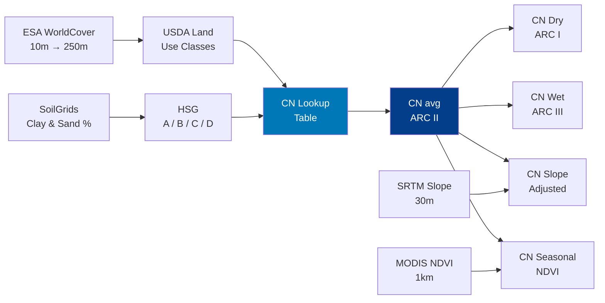

# 📐 Scientific Methodology & Equations

> **Sudan Improved Hydrologic Curve Number Application**
> Complete mathematical framework for rainfall-runoff modeling based on the GCN250 methodology (Jaafar et al., 2019)

---

## Table of Contents

1. [Processing Pipeline](#1-processing-pipeline)
2. [Hydrologic Soil Group Classification](#2-hydrologic-soil-group-classification)
3. [Curve Number Lookup Table](#3-curve-number-lookup-table)
4. [CN for Antecedent Runoff Conditions](#4-cn-for-antecedent-runoff-conditions)
5. [Slope Adjustment (Sharpley-Williams)](#5-slope-adjustment--sharpley-williams-equation)
6. [Seasonal NDVI Adjustment](#6-seasonal-ndvi-adjustment)
7. [SCS-CN Runoff Equation](#7-scs-cn-runoff-equation)
8. [NASA GPM Rainfall Processing](#8-nasa-gpm-rainfall-processing)
9. [Flood Risk Composite Index](#9-flood-risk-composite-index)
10. [Statistical Analysis](#10-statistical-analysis)
11. [References](#11-references)

---

## 1. Processing Pipeline

---

## 2. Hydrologic Soil Group Classification

Hydrologic Soil Groups (HSG) classify soils by their infiltration capacity. Derived from OpenLandMap SoilGrids clay and sand fractions at the surface:

### Equation 1 — HSG Decision Rules

$$
\text{HSG} = \begin{cases}
\textbf{A} & \text{Sand} > 85\% \text{ and } \text{Clay} < 10\% \\
\textbf{B} & 10\% \leq \text{Clay} < 20\% \text{ and } \text{Sand} \geq 50\% \\
\textbf{C} & 20\% \leq \text{Clay} \leq 40\% \\
\textbf{D} & \text{Clay} > 40\% \\
\textbf{C} & \text{otherwise (default)}
\end{cases}
$$

| HSG | Soil Type | Infiltration Rate | Runoff Potential |
|-----|-----------|-------------------|------------------|
| **A** | Deep sand, loamy sand, sandy loam | High (> 7.6 mm/hr) | Low |
| **B** | Silt loam, loam | Moderate (3.8–7.6 mm/hr) | Moderate |
| **C** | Sandy clay loam | Slow (1.3–3.8 mm/hr) | Moderately High |
| **D** | Clay, silty clay, clay loam | Very slow (< 1.3 mm/hr) | High |

> **Source:** USDA-NRCS National Engineering Handbook, Part 630, Chapter 7.
> Soil texture: ISRIC OpenLandMap SoilGrids (250 m).

---

## 3. Curve Number Lookup Table

Each pixel receives a CN based on **land cover** × **HSG** using the USDA NEH-630 Chapter 9 lookup:

### Equation 2 — CN Assignment

$$
CN_{\text{raw}}(x) = \text{LUT}\Big[\text{LandCover}(x),\; \text{HSG}(x)\Big]
$$

| WorldCover Class | Code | HSG-A | HSG-B | HSG-C | HSG-D |
|------------------|------|-------|-------|-------|-------|
| Tree Cover | 10 | 33 | 58 | 72 | 78 |
| Shrubland | 20 | 42 | 62 | 75 | 81 |
| Grassland | 30 | 39 | 61 | 74 | 80 |
| Cropland | 40 | 57 | 68 | 75 | 78 |
| Built-up | 50 | 89 | 92 | 94 | 95 |
| Bare / Sparse | 60 | 77 | 86 | 91 | 94 |
| Water Bodies | 80 | 100 | 100 | 100 | 100 |
| Wetlands | 90 | 100 | 100 | 100 | 100 |
| Mangroves | 95 | 100 | 100 | 100 | 100 |
| Moss / Lichen | 100 | 49 | 69 | 79 | 84 |

### Equation 3 — Final Average CN (ARC II)

$$
CN_{\text{avg}} = \sum_{g \in \{A,B,C,D\}} \left[ CN_g \cdot \mathbb{1}\{\text{HSG} = g\} \right], \quad CN_{\text{avg}} \in [0, 100]
$$

Pixels with $CN_{\text{avg}} \leq 0$ default to Group C values; remaining zeros default to $CN = 80$.

---

## 4. CN for Antecedent Runoff Conditions

The SCS method defines three Antecedent Runoff Conditions (ARC):

| Condition | Description | 5-Day Antecedent Rainfall |
|-----------|-------------|---------------------------|
| **ARC I (Dry)** | Soils are dry | < 36 mm (growing) / < 13 mm (dormant) |
| **ARC II (Average)** | Normal conditions | 36–53 mm (growing) / 13–28 mm (dormant) |
| **ARC III (Wet)** | Saturated soils | > 53 mm (growing) / > 28 mm (dormant) |

### Equation 4 — Dry Condition CN(I)

$$
\boxed{CN_{\text{dry}} = \frac{4.2 \cdot CN_{\text{avg}}}{10 - 0.058 \cdot CN_{\text{avg}}}}
$$

### Equation 5 — Wet Condition CN(III)

$$
\boxed{CN_{\text{wet}} = \frac{23 \cdot CN_{\text{avg}}}{10 + 0.13 \cdot CN_{\text{avg}}}}
$$

> **Reference:** Hawkins, R.H., Ward, T.J., Woodward, D.E. & Van Mullem, J.A. (1985).
> All CN values are clamped to $[0, 100]$.

---

## 5. Slope Adjustment — Sharpley-Williams Equation

The standard SCS-CN was developed for moderate slopes (≤ 5%). The Sharpley-Williams (1990) correction adjusts for terrain:

### Equation 6 — Slope-Adjusted CN

$$
\boxed{CN_{\text{slope}} = \left(CN_{\text{wet}} - CN_{\text{avg}}\right) \cdot \left[1 - 2 \cdot e^{-13.86 \cdot \tan(\alpha)}\right] + CN_{\text{avg}}}
$$

### Equation 6a — Slope Conversion

$$
\tan(\alpha) = \tan\left(\text{slope}_{\text{degrees}} \times \frac{\pi}{180}\right)
$$

| Variable | Description | Units | Source |
|----------|-------------|-------|--------|
| $CN_{\text{slope}}$ | Slope-adjusted Curve Number | — | Output |
| $CN_{\text{wet}}$ | CN for ARC III | — | Eq. 5 |
| $CN_{\text{avg}}$ | CN for ARC II | — | Eq. 3 |
| $\alpha$ | Surface slope angle | degrees | SRTM 30 m |
| $\tan(\alpha)$ | Slope gradient | m/m | Computed |

**Behavior:**
- At $\alpha = 0°$ (flat): $CN_{\text{slope}} \approx CN_{\text{avg}}$ → no correction
- As slope increases: $CN_{\text{slope}} \to CN_{\text{wet}}$ → steeper slopes produce more runoff
- The exponential $e^{-13.86 \cdot \tan(\alpha)}$ decays to ~0 at slopes > 15°

> **Reference:** Sharpley, A.N. & Williams, J.R. (1990). EPIC — Erosion/Productivity Impact Calculator. USDA Technical Bulletin No. 1768.

---

## 6. Seasonal NDVI Adjustment

Vegetation density affects infiltration through canopy interception and root zone storage. MODIS MOD13A2 annual mean NDVI provides a seasonal correction:

### Equation 7 — Vegetation Factor

$$
f_{\text{veg}} = 0.15 \cdot \frac{\text{NDVI} - 0.1}{0.4}, \quad f_{\text{veg}} \in [0,\; 0.15]
$$

### Equation 8 — Seasonal CN

$$
\boxed{CN_{\text{seasonal}} = CN_{\text{avg}} \cdot \left(1 - f_{\text{veg}}\right)}
$$

| Variable | Description | Range |
|----------|-------------|-------|
| NDVI | Annual mean vegetation index (2023) | $[-1, 1]$ |
| $f_{\text{veg}}$ | Vegetation reduction factor | $[0, 0.15]$ |
| $0.1$ | Minimum NDVI threshold (bare soil) | — |
| $0.5$ | Maximum NDVI for full effect | — |
| $0.15$ | Maximum CN reduction (15%) | — |

> 🌿 Dense vegetation (NDVI ≥ 0.5) reduces CN by up to 15%, reflecting increased infiltration. Bare desert (NDVI < 0.1) receives no reduction.

---

## 7. SCS-CN Runoff Equation

The core equation developed by the USDA Soil Conservation Service for estimating direct surface runoff from rainfall events.

### Equation 9 — Potential Maximum Retention

$$
\boxed{S = \frac{25{,}400}{CN} - 254 \quad \text{(mm)}}
$$

$S$ represents the maximum depth of water the soil can retain. Constants derive from the original inch formula $(S = 1000/CN - 10)$ converted to metric.

### Equation 10 — Initial Abstraction

$$
\boxed{I_a = \lambda \cdot S = 0.2 \cdot S \quad \text{(mm)}}
$$

$I_a$ accounts for interception, depression storage, and infiltration before runoff begins. Standard $\lambda = 0.2$.

### Equation 11 — Direct Runoff Depth ⭐

$$
\boxed{Q = \begin{cases} \displaystyle\frac{(P - I_a)^2}{(P - I_a) + S} & \text{if } P > I_a \\[10pt] 0 & \text{if } P \leq I_a \end{cases}}
$$

| Variable | Description | Units | Range |
|----------|-------------|-------|-------|
| $Q$ | Direct surface runoff depth | mm | $0$ to $P$ |
| $P$ | Total rainfall depth | mm | $0$ to $200+$ |
| $S$ | Potential maximum retention | mm | $0$ to $\infty$ |
| $I_a$ | Initial abstraction | mm | $0$ to $0.2S$ |
| $CN$ | Curve Number (any product) | — | $30$ to $100$ |
| $\lambda$ | Initial abstraction ratio | — | $0.2$ |

### Equation 12 — Runoff Coefficient

$$
C_r = \frac{Q}{P} \times 100\%
$$

### Behavior by CN Value

| CN | S (mm) | Iₐ (mm) | Q at P=50mm | Ratio | Interpretation |
|----|--------|----------|-------------|-------|---------------|
| 40 | 381.0 | 76.2 | 0.0 mm | 0% | High infiltration |
| 60 | 169.3 | 33.9 | 1.3 mm | 2.6% | Low runoff |
| 75 | 84.7 | 16.9 | 8.1 mm | 16.2% | Moderate runoff |
| 85 | 44.8 | 9.0 | 18.9 mm | 37.8% | Significant runoff |
| 95 | 13.4 | 2.7 | 35.3 mm | 70.6% | Very high (urban) |

---

## 8. NASA GPM Rainfall Processing

Real satellite rainfall from NASA GPM IMERG V07:

### Equation 13 — Daily Rainfall Accumulation

$$
P_{\text{daily}}(x) = \overline{R_{\text{half-hourly}}(x)} \times 24 \quad \text{(mm/day)}
$$

| Variable | Description | Units |
|----------|-------------|-------|
| $R_{\text{half-hourly}}$ | GPM IMERG precipitation rate | mm/hr |
| $\overline{R}$ | Mean rate over 24 hours (48 timesteps) | mm/hr |
| $P_{\text{daily}}$ | Daily rainfall accumulation | mm/day |

### Equation 14 — GPM-Based Runoff

$$
Q_{\text{GPM}}(x) = \text{SCS-CN}\Big(P_{\text{daily}}(x),\; CN_{\text{avg}}(x)\Big)
$$

> 🛰 Dataset: `NASA/GPM_L3/IMERG_V07` — 0.1° (~11 km), 2000–present.

---

## 9. Flood Risk Composite Index

Combines runoff potential, terrain susceptibility, and population exposure:

### Equation 15 — Flood Risk Index

$$
\boxed{\text{FRI} = 0.4 \cdot \hat{CN} + 0.3 \cdot \hat{S}_{\text{inv}} + 0.3 \cdot \hat{P}_{\text{pop}}}
$$

### Equation 16 — CN Component (Runoff Potential)

$$
\hat{CN} = \frac{CN_{\text{avg}} - 30}{70}, \quad \hat{CN} \in [0, 1]
$$

### Equation 17 — Slope Component (Terrain Susceptibility)

$$
\hat{S}_{\text{inv}} = 1 - \frac{\min(\text{slope},\, 30°)}{30°}, \quad \hat{S}_{\text{inv}} \in [0, 1]
$$

### Equation 18 — Population Component (Exposure)

$$
\hat{P}_{\text{pop}} = \frac{\log_{10}\!\big(\max(\text{Pop}, 0) + 1\big)}{4}, \quad \hat{P}_{\text{pop}} \in [0, 1]
$$

| Component | Weight | Logic | Data |
|-----------|--------|-------|------|
| $\hat{CN}$ | 40% | Higher CN → more runoff → higher risk | SCS-CN |
| $\hat{S}_{\text{inv}}$ | 30% | Flatter terrain → water accumulates | SRTM 30 m |
| $\hat{P}_{\text{pop}}$ | 30% | More people → more exposure | WorldPop 2020 |

> ⚠️ **Interpretation:** FRI = 0.0 (low risk) to FRI = 1.0 (extreme risk). Inverse slope is used because flat areas accumulate water.

---

## 10. Statistical Analysis

### Equation 19 — Spatial Statistics over AOI

$$
\bar{CN}_{\text{AOI}} = \frac{1}{N}\sum_{i=1}^{N} CN(x_i)
$$

$$
\sigma_{CN} = \sqrt{\frac{1}{N-1}\sum_{i=1}^{N}\left(CN(x_i) - \bar{CN}\right)^2}
$$

Where $N$ = number of pixels in the AOI (computed at 5 km scale with `bestEffort: true`).

---

## 11. References

1. **Jaafar, H.H., Ahmad, F.A. & El Beyrouthy, N.** (2019). GCN250, new global gridded curve numbers for hydrologic modeling and design. *Scientific Data*, 6, 145. [doi:10.1038/s41597-019-0155-x](https://doi.org/10.1038/s41597-019-0155-x)

2. **USDA-NRCS** (2004). National Engineering Handbook, Part 630 — Hydrology. Chapter 7: Hydrologic Soil Groups. Chapter 9: Hydrologic Soil-Cover Complexes. Chapter 10: Estimation of Direct Runoff from Storm Rainfall.

3. **Sharpley, A.N. & Williams, J.R.** (1990). EPIC — Erosion/Productivity Impact Calculator: 1. Model Documentation. USDA Technical Bulletin No. 1768.

4. **Hawkins, R.H., Ward, T.J., Woodward, D.E. & Van Mullem, J.A.** (2009). Curve Number Hydrology: State of the Practice. ASCE.

5. **Zanaga, D. et al.** (2022). ESA WorldCover 10 m 2021 v200. [doi:10.5281/zenodo.7254221](https://doi.org/10.5281/zenodo.7254221)

6. **Huffman, G.J. et al.** (2023). NASA GPM Integrated Multi-satellite Retrievals for GPM (IMERG) V07. NASA GES DISC.

7. **Hengl, T. et al.** (2017). SoilGrids250m: Global gridded soil information. *PLOS ONE*, 12(2). [doi:10.1371/journal.pone.0169748](https://doi.org/10.1371/journal.pone.0169748)

8. **Tatem, A.J.** (2017). WorldPop, open data for spatial demography. *Scientific Data*, 4, 170004.

---

**Sudan Hydrologic Curve Number Application — v4.2**

[🚀 Launch App](https://ee-osmangeomatics1993.projects.earthengine.app/view/sudan-hydrologic-curve-number-application) · [📂 GitHub](https://github.com/Osman-Geomatics93/Sudan-GCN-App)

